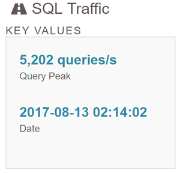
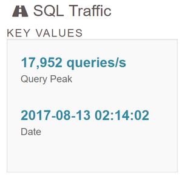

Title: Insulae - Oktober 2017 Status
Date: 2017-10-04 14:50
Author: Jan H. Krüger
Tags: Insulae, Zwischenstand, PBBG, Browsergame
Category: Insulae
Slug: insulae-stand-oktober2017
Series: Insulae-Stand

Puh, wieder einen Monat rum. Oder fast zwei. Ok, vier. Ich war faul. Eigentlich hatte ich schon im September mit diesem Beitrag angefangen aber dann nicht fortgeführt. Egal, jetzt, am 28. dann noch kurz vor Schluss :)

Aus dem September gibt es bei mir nichts zu berichten. Ich habe zwar nicht nichts getan, doch wirklich produktiv war der Monat, für Insulae gesehen, nicht.

Im Oktober gab es schon mehr jedoch auch eher im Background. Die jährliche Überprüfung der Schiffsreichweiten hat statt gefunden. Die einzige Verschiebung welche ich gesehen habe ist das für extreme Langstrecken derzeit eher auf Reisemagier zurück gegriffen wird. Ansonsten gibt es keine nennenswerte Verschiebung. Daher werde ich auch in diesem Jahr keine weitere Anpassung der Schiffe vornehmen.

Alt:

Neu:

Ingame: Der Krieg der Götter ist immer noch dabei. Da zuckt noch was. Auch wenn es sich schon spürbar beruhigt hat.

[1]: https://app.swaggerhub.com/apis/janhkrueger/InsulaeAPI/1
[2]: https://api.insulae.janhkrueger.de/town
