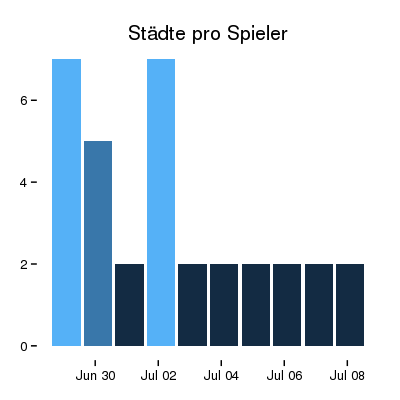
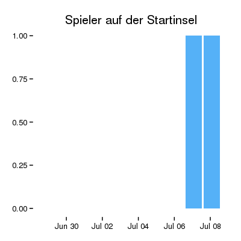

Title: Visualisierung der Key Performance Indicators
Date: 2015-07-08 12:12
Author: Jan H. Krüger
Tags: Insulae, KPI, Key Performance Indicators, R, Diagramm

Vor einiger Zeit habe ich angefangen in Insulae essentielle Daten zur Spielsteuerung zu sammeln, Werte auf denen ich weitere Entscheidungen aufsetze. Die Key Performance Indicators. Bisher waren sie immer nur als Zahlenwerte in der Datenbank. Nachdem ich "[Data Science behind EVE Online][1]" gelesen habe, starte ich den nächsten Schritt. Die Visualisierung der Daten.

Wie in dem Vortrag habe ich auch [R][3] genutzt. Ich glaube wenn ich den Vortrag nicht gelesen hätte wäre ich nie auf diese Sprache aufmerksam geworden. Doch eine kurze Session in der Nacht und das erste Diagramm war fertig. Kurzfassung: die Basics sind schnell und einfach erfasst. Die Verbindung mit der Insulae-Datenbank ist ohne großen Aufwand hergestellt. Die Erzeugung eines Diagrammes ebenso.

Ein Punkt der denke ich ganz gut rüber kommt ist einer der sonst oft für Kritik sorgte. Die Möglichkeit in Insulae mehrere Städte zu führen. Also mal auf die Zahlen schauen.

Das sieht doch recht ernüchternd aus. Es werden immer die Maximalzahlen ausgewiesen. Das Maximum was ein Spieler an Städten führt sind also 2 Städte mit drei Tagen Abweichung. Warum ist es da bei einem Spieler so hoch gegangen? Eine weitere Untersuchung zeigte sich: an diesem Tag hat ein Spieler für drei andere die Vertretung übernommen womit die von ihm beeinflussbaren Städte auch anstiegen. Nachdem die eigentlichen Spieler wieder zurück kehrten normalisierte sich das wieder.
Trotz der Vorteile die es bieten kann haben sich also keine Spieler dazu entschieden mehr wie zwei Städte ihr Eigen zu nennen.

Der nächste, für Insulae an sich nicht so relevante Teil: wieviele Spieler befinden sich gerade noch auf der Startinsel. 

Das entspricht genau dem was ich erwartet habe nachdem ich erst einen neuen Spieler zugelassen habe. Wenn ich das über die nächsten Tage verfolgt wird sich das wohl wieder auf 0 senken. Wobei streng genommen nicht die Anzahl der Spieler dort interessant ist sondern wie lange sie dort verweilen. Doch das ist eine andere Auswertung.

Ein an sich notwendiger Schritt wäre nun diese Zahlen und Grafiken in ein Dashboard einzubinden um die Inhalte stets schnell präsent zu haben. Das kommt irgendwann später, wenn mehr Zeit und so ;) Doch erst steht an die weiteren KPIs die ich derzeit sammle darzustellen. Ich denke das nächste wird ein Tortendiagramm über die in der letzten Zeit am häufigsten genutzten Gegenstände sein.

Wobei mich diese Inhalte auch einmal für [Scherbenwelten][5] interessieren würde. Da lassen sich bestimmt auch gute Diskusstionsgrundlagen herauslesen.

Insgesamt lassen sich mit R und dem Paket [ggplot2][4] sehr schnell elegante Diagramme erzeugen. Nachdem was ich bisher gesehen habe: ein Blick lohnt sich.

Ein Beispiel wie ich die obigen Diagramme anlegen kann [hier][2] eingesehen werden. Das ist aus der ersten nächtlichen Session entstanden. Der Anspruch war "Ergebnis, schön später."

[1]: https://dl.dropboxusercontent.com/u/1019227/datascience_presentation/index.html#/
[2]: https://phabricator.janhkrueger.de/P6
[3]: http://www.r-project.org/
[4]: http://ggplot2.org/
[5]: http://scherbenwelten.de