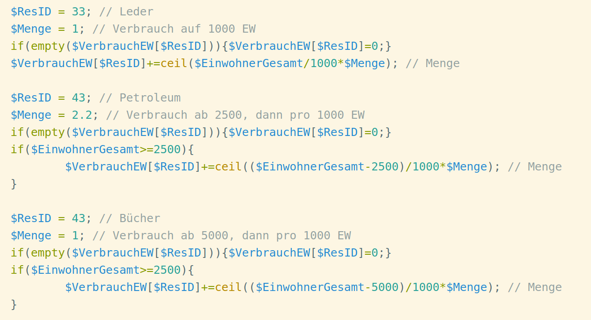
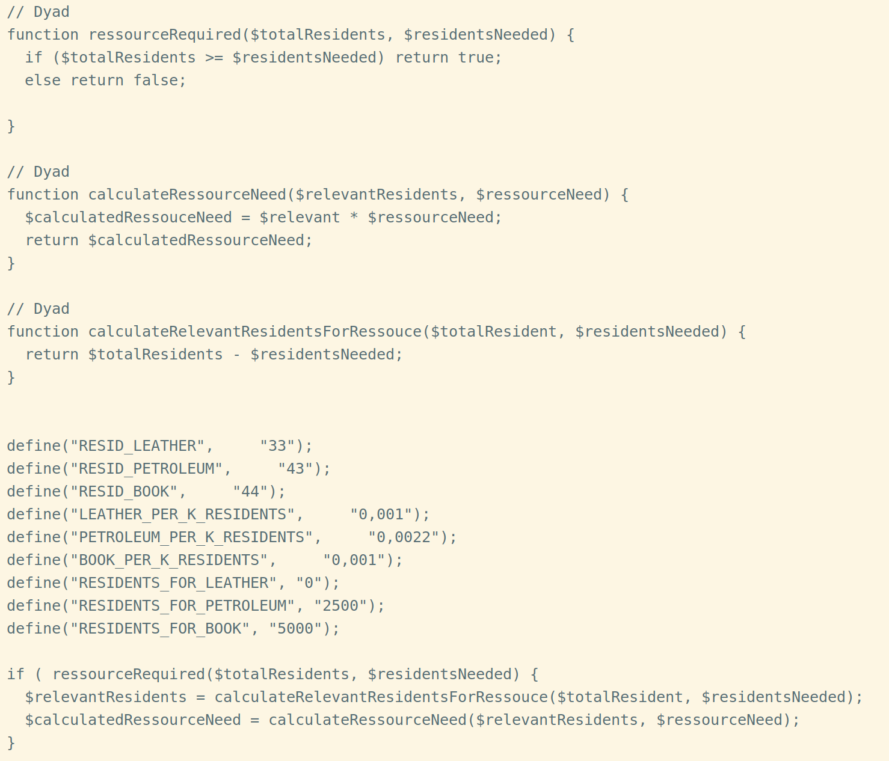
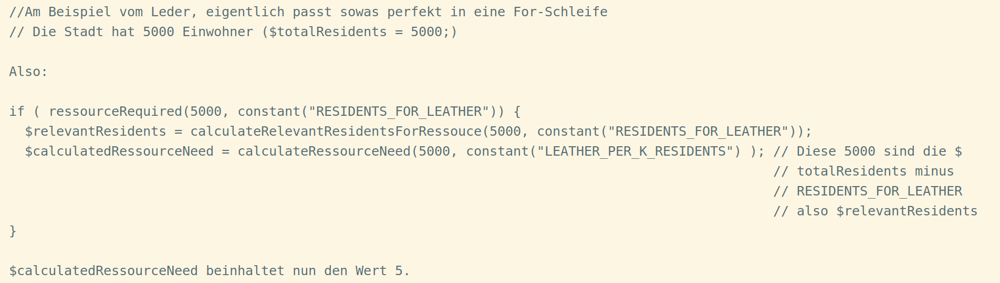
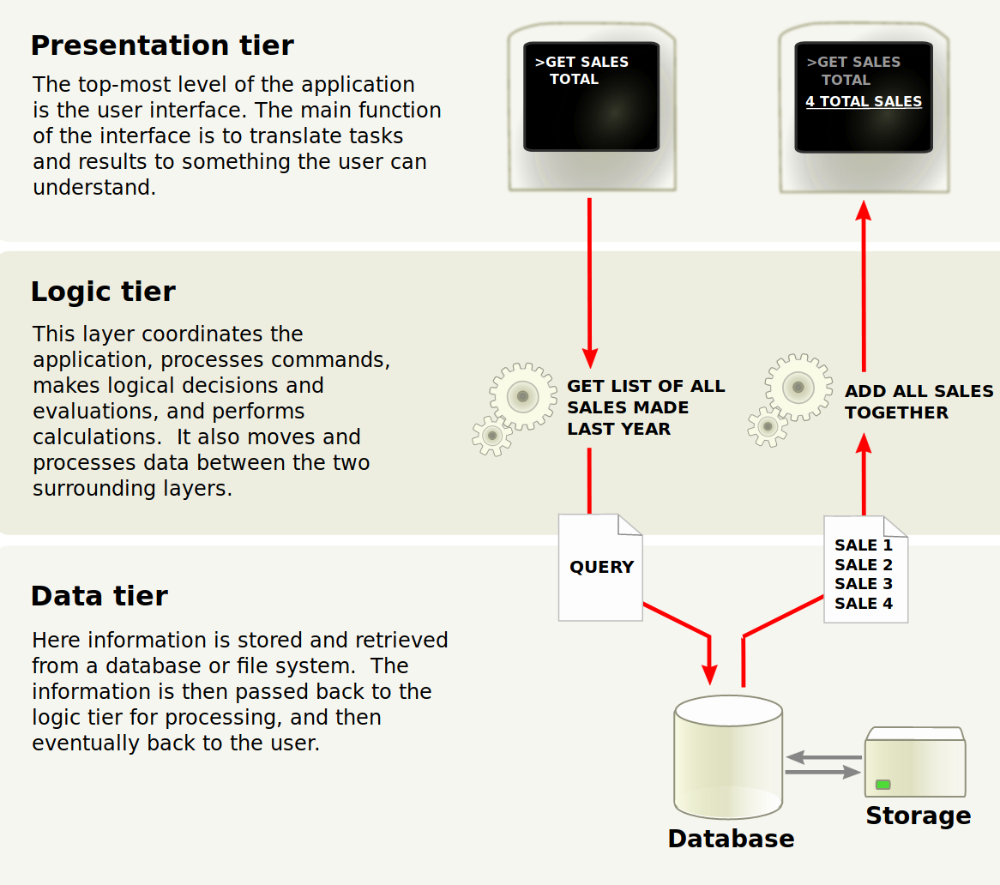

Title: QoI Review
Date: 2019-03-22 08:27
Author: Jan H. Krüger
Slug: qoireview
Status:hidden

**Handwerklich**

- Kein Schichtenmodell. Ergo Logik, DB und Präsentation in einem File gemischt. Dies wird später es unnötig schwer machen die DB Schicht und oder die Präsentationsschicht auszutauschen / modernisieren.
- Designmuster insgesamt waren nicht zu erkennen. Teilweise eine Konsequenz des folgenden Punktes.
- Keine Objektorientierung. Daher völliger Ausschluss von Unittests.
- Ohne Unittests kann keine messbare Qualität über die Korrektheit des Codes gegeben werden und ob die Resultate nach einer Änderungen noch zutreffen.
- Mangels Objektorientierung weiterhin unnötig komplizierte Arraystrukturen welche die Lesbarkeit, Wartung und Erweiterbarkeit komplizierter gestalten.
- Keine CI/CD Prozesse. Kein automatischer Build, Test und Deploy.
- Verzicht auf eine Quellcodeverwaltung. Keine Anwendung von common practises wie feature branches, dev oder überhaupt branching.
- Somit keine Möglichkeit im Nachgang zu ermitteln wann ein Fehler einmal in den Quellcode kam, weiterführend im Zweifel keine Möglichkeit mit dieser Information zu ermitteln wieviele Accounts / Spieler / Stadt / etc. von einem Fehler betroffen sein können.
  - Beispiel kann sein das die Codeabschnitte für die Startgegenstände nach einem Update nicht mehr korrekt arbeiten und Charakteren keinen Heiltrank geben. Mit der Information ab wann das so war kann jedem seitdem erzeugtem Charakter ein Trank zugeschoben werden.
- Backup bestand Anfang März noch aus dem manuellen Kopieren im Dateisystem. Keine räumlich externe Sicherung zB privaten Repositories auf GitHub oder GitLab.
  - Das führte unter anderem dazu das Anfang März im Filesystem mehrere Versionen des Kartenprogrammes existierten. Im kommerziellen Bereich ein NoGo.
- Issuetracker in Excel. Transparentes und kollaboratives Arbeiten so später nicht möglich. Eine Auswertbarkeit oder Kommunikation am Ticket selbst nicht möglich sondern nur über Forum. Eine transparente Kommunikation mit dem Endkunden über Issues ist so nicht möglich und darüber hinaus auch für Endkunden nicht nachvollziehbar. Ticketsysteme helfen auch nach Jahren noch alte Fälle elegant zu suchen und damalige Begründungen wieder zu finden.
  - Weiterhin kann so auch kein Preclearing von Issues durch Helfer vorgenommen werden damit sich Entwickler nur auf das relevante konzentrieren können.
- Aussagen und Designentscheidungen anhand von SharedHosting. Aus eigener Erfahrung, das was bei SharedHosting zuerst in die Knie geht ist die DB Performance.
- Vermischung englischer und deutscher Variablenbezeichner.
- Vermischung deutscher und englischer Bezeichner in der Datenbank.
- Nutzung von Umlauten in Variablennamen.
  - Diese drei Punkte sind üblich bei unseren jungen Auszubildenden ohne Erfahrung. Es fehlt noch der eigene, gefestigtste Codingstil.
- Nutzung von mysqli anstatt PDO. Dies wird es zukünftig unnötig erschweren das Datenbanksystem auszutauschen.
- Bezogen auf das Stadtskript sind Rassen hart im Code hinterlegt mit ihrer Anzahl und ihrem Verbrauch. Das macht eine spätere Änderung unnötig schwierig da jede Codestelle manuell verändert werden muss. Gefahr relevante Codestellen zu übersehen bei Änderungen. Hier ist ein Weg über die Datenbank sinniger und keine harten Grenzen zu definieren. Anpassungen im Rassenverbrauch, zB durch ein Balancing erfordern direkten Codeeingriff samt Deploy anstatt Updates via Datenbank.
  - Besser: die benötigten Werte dynamisch zur Laufzeit ermitteln und dann im Code nur die Daten durchiterieren. Dann reicht es auch in der DB zentral eine neue Rasse zu hinterlegen mit ihren Daten und es sind später keine Codeanpassungen notwendig.
- Hart hinterlegte Anzahlen mit IDs der Waren.
  - Die letzten beiden Punkte waren auch exakt jene Schwierigkeiten welche bei SW am Ende es kompliziert gestaltet haben neue Waren, Rassen, Berufe und Zauber einzubauen. Ich vermute das ist es auch was Goose einmal meinte mit als er sagte das der Code nicht schön sei.
- Der vom SharedHoster (oder Managed, was es nicht besser macht) aufgezwungene Upgrade auf PHP7 wurde als Hindernis gesehen. Die Version 5.6 von PHP ist nicht mehr für einen produktiven Einsatz vorgesehen. Die v7 ist im Dezember 2015 erschienen. Bei noch nicht produktiven Systemen mit einer bewusst alten Version zu arbeiten ist unter Performance- und Sicherheitsaspekten kritisch und muss normalerweise gut begründet werden.
  - Argon2 als Hashfunktion für Passwörter ist erst ab 7.2 mit aufgenommen worden. Argon2 ist Sieger der 2017er Challenge zum Passwortcracken und kann somit bcrypt, sha256 etc ersetzen.
  - Austausch des secure random generators.
  - Persönliche Vermutung: es fand keine bewusste Auseinandersetzung und Auswahl statt sondern wurde mit den Eckdaten des SharedHosters gearbeitet.
- Es wurde die Aussage getroffen das auch eine eigene Verschlüsselung entwickelt wurde. Sicherheitstechnisch ist eins solches Vorgehen ein Supergau. Niemand entwickelt für belastbare Systeme eigene Verschlüsselungen sondern setzt auf existierende Lösungen welche von anderen Stellen überprüft und bewertet wurden. Mathematisch.
  - Passwörter salten ist keine Verschlüsselung. Pepper ebenso wenig.

Auszug aus der Stadtauswertung:

**Verstoß gegen DRY (Don&#39;t repeat yourself) (Zweimal!)**

Die Abschnitte für jede Ressource erledigen exakt identische Ausgaben. Das gehört in eine eigene Funktion.

Die Initialisierung der Vectoren mit 0 gehört in die Anlage davon. Zur Not mit array\_fill()

Die hart hinterlegten Schwellen sind wenn als Konstanten zu hinterlegen, aus dem Code ergibt sich nicht was bei 1000, 2500, 5000 für eine besondere Bedeutung haben.

Kommentare beschreiben bei den Büchern nicht was passiert.

ResID bei den Büchern falsch.

Die Division durch 1000 kann wegfallen wenn die Verbrauchsmenge direkt durch 1000 geteilt angeben wird. Erspart die Rechenzyklen und erleichtert die Lesbarkeit.

0,001 statt 1

0,0022 statt 2,2

**Besser, wenn auch noch nicht schön:**

(Liese sich mit Klassenattributen mindestens an zwei Stellen auf Monadic runter gehen.)

!

Insgesamt jedoch, ohne Klassen: unnötig kompliziert. Ohne Datenbank in welcher die Steuergrößen stehen, unnötig kompliziert.

**Design**

Die Karte wird nicht in der Datenbank gehalten sondern als Image im Filesystem. Dies persönlich halte ich in einer Multiuserumgebung für einen Flaschenhals selbst wenn der Zugriff berechnet wird und dann bewusst ein seek abgesetzt wird.

Datenbankmanagementsysteme können aufgrund ihrer nativen Caching und Optimizer schneller lesen. Wozu ich keine Aussage tätigen kann ist wie sich dieses Verfahren verhält wenn \&gt; 800 konkurrierende Spieler plus NPCs auf die Karte zugreifen möchten. Cachingmechanismen des RDMS oder gar InMemorydatenbanken wie Redis können hier nicht zur Anwendung kommen.

Das hat jedoch noch weitere Konsequenzen. Eine Insel kann nicht eineindeutig identifiziert werden. Es kann nur über einen Bereich identifiziert werden was eine Insel genau ist.

Das wiederum bringt uns zu zwei Problemen. Bei der alten Lohkarte war im Nordosten noch eine weitere Insel. Wenn man nur über den Bereich geht wäre diese Insel im Bereich Loh mit enthalten obwohl dies inhaltlich nicht korrekt ist.

Es ist so derzeit nicht möglich in Echtzeit Änderungen an Inseln vorzunehmen. Inseln wandern zu lassen, mittels DB-Updates zu verändern (Hallo Apokalypse-Zauber 🙂 ), dynamische Änderungen aufgrund des Wetters... diese Änderungen fallen allesamt raus bzw. sind wenn nur durch vermeidbare Mehraufwände zu erreichen.

Die hart hinterlegten Waren, Rassen, Verbräuche konterkarieren eine zukunftsweisende Entwicklung und entsprechen den Hürden aus SW welche letztlich eine effektive Entwicklung auch behindert haben.

Diese Sachen wieder auszubauen ist mühsam wie ich selbst an Insulae im Laufe der letzten 17 Jahre erlebt habe. Bei einer Plattform welche live ist und ohne die Möglichkeit dieses Feature separat zu entwickeln und nachweisbar, messbar zu testen gleicht dies eine Operation am offenen Herzen.

Es findet keine Verwendung von Microservices statt was sich ebenfalls negativ auf die Zukunftsfähigkeit, Wartungsfreudlichkeit und Skalierung auswirkt.

Ein großer Kritikpunkt ist in meinen Augen jedoch der Umgang mit nicht an den Support geschriebenen Nachrichten. Sie wurden bereits im September 2018 nach Schlüsselworten durchsucht, gelesen und daraufhin auch OOG Aktionen durchgeführt. Eine private Unterhaltung ist damit innerhalb des Spieles nicht mehr möglich, es muss stets davon ausgegangen werden das Nachrichten gelesen und inhaltlich verwendet werden. Nicht nur das dies ein grober Eingriff in die Privatsphäre ist, auch jegliche tiefere Vertrauensbasis in die Rolle des Betreibers ist damit nachhaltig beschädigt.

Austausch von Handynummern wie früher zur Vorbereitung von Treffen? Private E-Mails austauschen? Vielleicht auf die Frage wie es einem geht da man tagelang nichts mehr voneinander gehört hat mit vertraulichen Details antworten? Undenkbar geworden da der Betreiber all dies nicht nur lesen kann sondern auch dies bereits getan hat.

Spieler werden sich daher andere Kommunikationskanäle suchen, die Zeit welche Spieler auf der Plattform verbringen geringer. Die Bindung an das Produkt nimmt ab und damit wird es für Spieler wieder einfacher der Plattform im Zweifel den Rücken zu kehren.

Auch aus anderer Perspektive ist dies problematisch. Es wurde Zeit und Arbeitskraft verwendet um zu erfahren was Spieler über den Betreiber und das Spiel denken. Der Fokus ist von der Entwicklung der Plattform hin zur eigenen Aussenwahrnehmung gewandert. Bewusst ohne die Spieler persönlich und direkt anzusprechen.

**Fazit**

Derzeit ist der Code von QoI in meinen Augen nicht zukunftsfähig da zu viele Einschränkungen und AntiPatterns vorhanden sind.

Das sind insgesamt alles Themen welche Anfänger begehen, ausgebildete oder erfahrene Entwickler vermeiden bzw. nicht begehen. Hierbei ist es auch nicht relevant was man alles schon in Büchern oder im Internet gelesen hat. Die Erfahrung benötigt Zeit und Praxis.

Ist QoI lauffähig auch mit den ganzen oben genannten Themen? Klar. Insbesondere zum Start.

Interessant wird es dann wenn neue Features eingebaut werden sollen oder eine Weltveränderung. Eine Entwicklungssituation wie sie SW zuletzt hatte halte ich für zwingend zu vermeiden. Gerade als Anfänger ist es wichtig auf den Input anderer zu hören. Dieser ist selten persönlich gemeint sondern bezieht sich auf das fachliche. Meistens kommt der Input auch weil das Gegenüber selbst unter Schmerzen gelernt hat das die ganzen Bücher doch recht haben und die Designpattern, Schichten, Strukturen und best practises letztendlich Sinn ergeben und auf den Erfahrungen von Generationen Füßen.

Um fair zu sein. Auch in Insulae habe ich noch Antipattern aus meiner Anfangszeit 2002/2004. In den Codeteilen welche ich seitdem nicht mehr gearbeitet habe. Dennoch bin ich mir ihrer bewusst und habe damit ich den Gang hin zu OpenSource gehen kann mit einem Refactoring angefangen. Jedoch würde ich heutzutage bei den Informationen und Büchern über Softwarearchitektur gewisse Dinge gar nicht mehr beginnen.

Die größte Hürde für das Spiel wird der Entwickler selbst sein.

Niemand weiß alles und selbst nach jahrelangen Erfahrungen gibt es immer noch neue Themen oder Veränderungen des bestehenden. Die IT Welt ist konstanten Änderungen und Wechselwirkungen unterworfen.

Gerade als Soloentwickler ist eine offene Einstellung gegenüber neuen Themen erforderlich ebenso wie die Bereitschaft Anmerkungen und Hinweisen anderer Entwickler auch aufzunehmen und nicht ablehnend zu reagieren.

Erfahrung kann nicht durch lesen im Internet gesammelt werden sondern nur durch Praxis. Zu behaupten durch Internetrecherche Situationen besser bewerten zu können wie Personen welche beruflich seit Jahren und partiell Jahrzehnten ist überheblich und öffnet die Tür für die typischen Anfängerfehler.

**Bezüglich PDO**

|    | **PDO** | **MySQLi** |
| --- | --- | --- |
| **Database support** | 12 different drivers | MySQL only |
| **API** | OOP | OOP + procedural |
| **Connection** | Easy | Easy |
| **Named parameters** | Yes | No |
| **Object mapping** | Yes | Yes |
| **Prepared statements** **(client side)** | Yes | No |
| **Performance** | Fast | Fast |
| **Stored procedures** | Yes | Yes |

**Multitierarchitektur**

